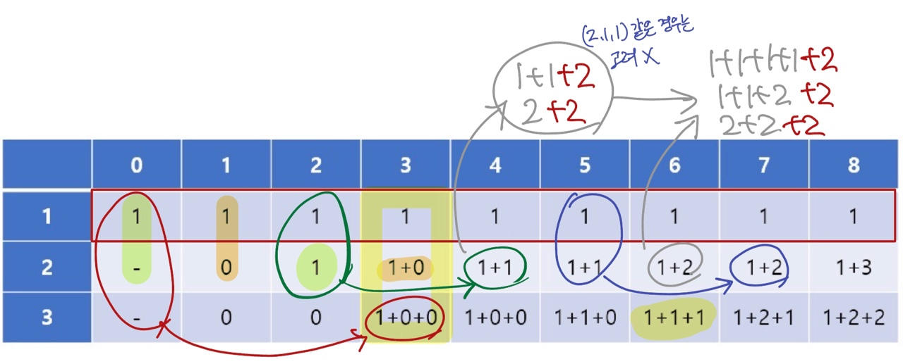

## Info
[15989 1, 2, 3 더하기 4](https://www.acmicpc.net/problem/15989)

## 💡 풀이 방법 요약
> 2차원 dp와 오름차순
- `dp` 배열을 2차원으로 나타내어 마지막 원소를 기록함
- 1로만 어떤 수를 만드는 경우의 수는 1개
- 2를 추가하여 어떤 수를 만드는 것은 그 수보다 2 작은 수를 만드는 경우의 수를 참고
- 이 때 2를 한 번 추가하면 그 뒤로는 1이 나올 수 없음
- 1에서부터 중복이 발생하지 않는 정책으로 채워질 수 있다

## 🙂 마무리
중복을 없애는 방법을 생각하기가 어렵다...