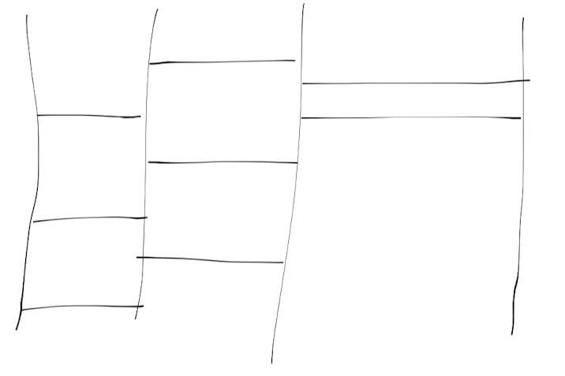

## Info
[15684 사다리 조작](https://www.acmicpc.net/problem/15684)

## 💡 풀이 방법 요약
사다리가 놓여진 곳을 1, -1로 설정함 -> 1 : 오른쪽으로, -1 : 왼쪽으로  
이것을 이용해서 백트래킹을 구현하였음  
  
추가로 각 자리에 놓인 오른쪽으로 가는 발판?, 혹은 왼쪽으로 가는 발판, 혹은 오른쪽 + 왼쪽이 홀수라면 그대로 False를 반환하였음  

## 🙂 마무리

